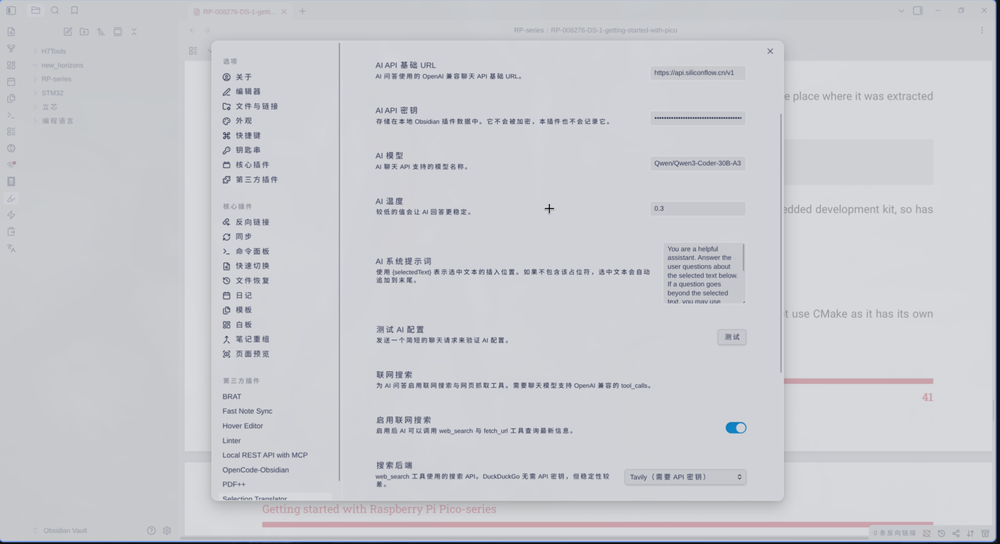

# Traductor de Selección

[中文说明](README.zh-CN.md)

[Características](#features) |
[Inicio Rápido](#quick-start) |
[Configuración](#settings) |
[Guía de Uso](#usage-guide) |
[Privacidad](#privacy) |
[Instalación](#install) |
[Preguntas Frecuentes](#faq) |
[Desarrollo](#development)

Selection Translator es un plugin de Obsidian para traducir texto seleccionado en el editor de Markdown y en PDFs seleccionables, con proveedores de traducción de IA y tradicionales seleccionables, además de búsqueda automática en diccionarios. Un panel de preguntas y respuestas (Q&A) de IA opcional te permite hacer preguntas de seguimiento sobre el texto seleccionado, con búsqueda web y obtención de páginas opcionales para obtener respuestas actualizadas.


---

## Características

### Traducción de Selección

- Traduce texto seleccionado en el editor de Markdown o texto seleccionable de PDFs desde la paleta de comandos, un atajo de teclado, el botón de la cinta o el menú contextual del editor de Markdown.
- Mantén el popover flotante abierto mientras seleccionas más texto; la nueva selección de Markdown o PDF se traduce automáticamente.
- Edita el texto fuente seleccionado en el popover y traduce de nuevo.
- Busca automáticamente una palabra en inglés seleccionada con el proveedor de diccionario configurado y reproduce las pronunciaciones UK/US cuando estén disponibles.


### Idiomas Predeterminados

- Establece los idiomas de origen y destino predeterminados en la configuración del plugin.
- Usa `Auto` como idioma de origen cuando quieras que un proveedor compatible detecte el idioma de entrada.


### Flujo de Trabajo del Popover

- Transmite el progreso, errores y resultados de la traducción en un popover arrastrable y redimensionable.
- Usa los botones compactos del encabezado para copiar el resultado completo, reintentar la traducción o cerrar el popover.
- Selecciona cualquier parte del resultado de la traducción y cópialo con el copiado nativo de teclado o menú contextual.
- El diseño del encabezado es compacto para pantallas de escritorio y móviles estrechos.

<p align="center">
  
</p>

### Soporte de Proveedores

- Elige el proveedor de traducción de texto. Los proveedores compatibles con OpenAI, Bing Translate (Microsoft Translator), Google Cloud Translation, DeepL, Baidu Translate y Youdao Translate son opciones seleccionables.
- Configura las credenciales requeridas por el proveedor seleccionado.
- Los proveedores compatibles con OpenAI soportan prompt, temperatura y salida en streaming. Las API de traducción tradicionales devuelven el resultado traducido cuando la solicitud del proveedor se completa.
- Una palabra en inglés seleccionada utiliza automáticamente el proveedor de diccionario configurado. Youdao Dictionary, Bing Dictionary y Cambridge Dictionary son seleccionables y no requieren una clave API.
- Prueba la configuración del proveedor antes de traducir.
- La interfaz del plugin sigue el idioma de la aplicación de Obsidian para Inglés y Chino Simplificado.


### Panel de Q&A de IA

- Desactivado por defecto. Activa **Habilitar Q&A de IA** en la pestaña de configuración **Q&A de IA** para mostrar la entrada de Q&A en el popover de traducción.
- Usa su propia configuración de chat compatible con OpenAI (URL base / Clave API / modelo / temperatura / prompt del sistema), completamente aislado del proveedor de traducción; puedes dirigirar la traducción a un endpoint y el Q&A a otro.
- Transmite la respuesta en el popover. El historial de múltiples turnos se limita a las 6 rondas más recientes de usuario/asistente; los turnos anteriores se eliminan automáticamente.
- Una vez que finaliza la transmisión, la respuesta se renderiza como Markdown (títulos, listas, **negrita**, `código en línea`, bloques de código y enlaces). El texto sin formato solo se muestra durante la transmisión; tus propias preguntas y mensajes de error permanecen como texto sin formato.
- La conversación de Q&A se reinicia automáticamente cuando cambias a una nueva selección.



### Búsqueda Web de Q&A de IA (Bucle de Agente)

- Desactivado por defecto. Activa **Habilitar búsqueda web** en la pestaña **Q&A de IA** para permitir que el modelo llame a dos herramientas antes de responder:
  - `web_search` — uno de Tavily, Serper.dev o DuckDuckGo (sin clave API).
  - `fetch_url` — lee una página web pública y devuelve su texto extraído.
- Requiere un modelo de chat que soporte `tool_calls` compatibles con OpenAI. Cuando está habilitado, el popover muestra una línea "🔍 Buscando …" / "📄 Leyendo …" para cada ronda de herramienta, luego transmite la respuesta final.
- Limitado por la configuración de **Número máximo de rondas de llamadas a herramientas** (por defecto `3`). Si el modelo aún quiere seguir buscando después del límite, el plugin fuerza una respuesta final con las herramientas deshabilitadas para que siempre obtengas una respuesta.

---

## Inicio Rápido

1. Instala el plugin con BRAT o instalación manual.
2. Abre **Ajustes -> Plugins comunitarios -> Selection Translator**.
3. Elige un **Proveedor de traducción**.
4. Elige un **Proveedor de diccionario** si quieres un proveedor diferente a Youdao Dictionary.
5. Configura las credenciales requeridas por el proveedor de traducción.
6. Establece el **Idioma de origen** y el **Idioma de destino** predeterminados.
7. Selecciona **Probar** para verificar la configuración del proveedor de traducción.
8. Selecciona texto en un editor de Markdown o texto seleccionable de PDF en la vista PDF de Obsidian.
9. Ejecuta **Traducir selección** desde la paleta de comandos, un atajo, el botón de la cinta o el menú contextual del editor.

El prompt predeterminado traduce de `Auto` a `Chino (Simplificado)` y devuelve solo el texto traducido.

---

## Configuración

La página de configuración está agrupada en las pestañas **Proveedor**, **Configuración de diccionario**, **Configuración de popover**, **Avanzado** y **Q&A de IA**.

### Proveedor

| Configuración | Predeterminado | Descripción |
| --- | --- | --- |
| Translation provider | `OpenAI-compatible` | Selecciona qué proveedor maneja las solicitudes de traducción no diccionario. |
| Source language | `Auto` | Idioma de origen predeterminado. Usa `Auto` para la detección del lado del proveedor cuando sea compatible. |
| Target language | `Chinese (Simplified)` | Idioma de destino predeterminado. |
| OpenAI-compatible API base URL | `https://api.openai.com/v1` | URL base del proveedor. El plugin agrega `/chat/completions` cuando es necesario. |
| OpenAI-compatible API key | empty | Token Bearer para el proveedor compatible con OpenAI configurado. |
| OpenAI-compatible model | empty | Nombre del modelo compatible con tu proveedor. |
| OpenAI-compatible prompt | built in | Instrucción de traducción para proveedores compatibles con OpenAI. Usa `{sourceLanguage}` y `{targetLanguage}` para los idiomas configurados. |
| OpenAI-compatible temperature | `0.2` | Los valores más bajos mantienen las traducciones más deterministas. |
| Maximum selection length | `4000` | Evita envíos accidentales grandes. Esta configuración se muestra con las opciones de OpenAI-compatible pero se aplica antes de cada solicitud del proveedor. |
| Bing/Microsoft Translator key | empty | Clave de suscripción para el recurso de Microsoft Translator utilizado por Bing Translate. |
| Bing/Microsoft Translator region | empty | Región del recurso, como `eastasia` o `global`. |
| Bing/Microsoft Translator endpoint | `https://api.cognitive.microsofttranslator.com` | Endpoint del traductor. |
| Google Cloud Translation API key | empty | Clave API para Google Cloud Translation Basic v2. |
| DeepL Auth Key | empty | Clave de autenticación de tu cuenta DeepL. |
| DeepL API base URL | `https://api-free.deepl.com` | Usa `https://api.deepl.com` para DeepL Pro. |
| Baidu Translate app ID | empty | ID de aplicación de Baidu Translate Open Platform. |
| Baidu Translate secret key | empty | Clave secreta de Baidu Translate Open Platform. |
| Youdao Translate app key | empty | Clave de aplicación de Youdao Zhiyun. |
| Youdao Translate app secret | empty | Secreto de aplicación de Youdao Zhiyun. |
| Test API configuration | - | Envía una solicitud de traducción corta para verificar la configuración del proveedor seleccionado. |

Los sitios web públicos de Google Translate y Bing Translator pueden ser gratuitos para uso manual, pero este plugin utiliza las API oficiales de los proveedores para esos proveedores. El acceso a la API requiere credenciales del proveedor incluso cuando este ofrece una cuota gratuita o nivel gratuito. La búsqueda en el diccionario es automática para una sola palabra en inglés seleccionada y utiliza el sitio web del diccionario configurado sin credenciales API.

| Proveedor | Nota de acceso API | Configuración de clave | Precios |
| --- | --- | --- | --- |
| Bing Translate (Microsoft Translator) | La API de Azure Translator tiene un nivel gratuito F0, pero aún requiere una clave de recurso de Azure Translator, endpoint y a veces región. | [Crea un recurso de Translator](https://learn.microsoft.com/en-us/azure/ai-services/translator/create-translator-resource) | [Precios de Azure Translator](https://azure.microsoft.com/pricing/details/cognitive-services/translator/) |
| Google Cloud Translation | Cloud Translation tiene créditos de uso mensual gratuitos, pero las llamadas API requieren un proyecto de Google Cloud, facturación, API habilitada y credenciales. | [Configuración de Cloud Translation](https://cloud.google.com/translate/docs/setup), [Crea claves API](https://cloud.google.com/docs/authentication/api-keys#create) | [Precios de Cloud Translation](https://cloud.google.com/translate/pricing) |
| DeepL | Requiere una cuenta de API DeepL y Auth Key. Usa `https://api-free.deepl.com` para API Free y `https://api.deepl.com` para API Pro. | [Autenticación de API DeepL](https://developers.deepl.com/docs/getting-started/auth) | [Planes de API DeepL](https://www.deepl.com/pro-api) |
| Baidu Translate | Requiere un App ID y clave secreta de Baidu Translate Open Platform. | [Documentación de API Baidu Translate](https://fanyi-api.baidu.com/doc/21), [Open Platform](https://fanyi-api.baidu.com/) | [Productos de Baidu Translate](https://fanyi-api.baidu.com/product/11) |
| Youdao Translate | Requiere una app key y app secret de Youdao Zhiyun. | [Guía para nuevos usuarios de Youdao](https://ai.youdao.com/doc.s#guide), [Gestión de aplicaciones](https://ai.youdao.com/appmgr.s), [Documentación API de traducción de texto](https://ai.youdao.com/DOCSIRMA/html/trans/api/wbfy/index.html) | [Precios de traducción de texto Youdao](https://ai.youdao.com/DOCSIRMA/html/trans/price/wbfy/index.html) |
| Dictionary lookup | No se requiere clave API. Envía una palabra en inglés seleccionada al sitio web del diccionario configurado y utiliza las URLs de audio de pronunciación del proveedor cuando estén disponibles. | [Youdao Dictionary](https://m.youdao.com/dict), [Bing Dictionary](https://cn.bing.com/dict), [Cambridge Dictionary](https://dictionary.cambridge.org/) | - |

### Configuración de Diccionario

| Configuración | Predeterminado | Descripción |
| --- | --- | --- |
| Dictionary provider | `Youdao Dictionary` | Selecciona qué sitio web del diccionario maneja la búsqueda de una sola palabra. Opciones: Youdao Dictionary, Bing Dictionary, Cambridge Dictionary. |

### Configuración de Popover

| Configuración | Predeterminado | Descripción |
| --- | --- | --- |
| Show selected text in popover | enabled | Muestra el texto seleccionado como un campo editable antes de reintentar. |

### Avanzado

| Configuración | Predeterminado | Descripción |
| --- | --- | --- |
| Enable cache | enabled | Cuando está habilitado, las traducciones repetidas del mismo texto dentro del TTL de caché omiten la red. |
| Cache TTL (seconds) | `600` | Tiempo de vida (TTL) para una entrada de caché. `0` significa sin expiración. De lo contrario, 60-86400. |
| Cache max entries | `256` | Máximo de traducciones en caché. La entrada más antigua se elimina primero (LRU). |
| Min interval (ms) | `1500` | Retraso mínimo por proveedor entre solicitudes consecutivas. `0` desactiva el throttling. |
| Enable retry | enabled | Reintenta errores 429/5xx y límites de tasa conocidos usando el backoff a continuación. |
| Max attempts | `2` | Intentos totales incluyendo el primero. `0` significa sin reintentos. |
| Base delay (ms) | `500` | Retraso inicial de backoff. Los retrasos subsiguientes se duplican hasta el máximo a continuación. |
| Max delay (ms) | `3000` | Límite superior del retraso de backoff. `baseDelayMs * 2^attempt + jitter` se ajusta a este valor. |
| Jitter ratio | `0.2` | Jitter aleatorio como fracción del retraso exponencial (0-0.5). |

Las respuestas de error del proveedor ahora incluyen el código de estado HTTP como `error.cause.status`. El bucle de reintento verifica esto primero (429 o 5xx ⇒ reintento); si falta, usa la lista de palabras clave (`invalid access limit`, `rate limit`, etc.) y una expresión regular para códigos numéricos.

### Q&A de IA

La pestaña de Q&A de IA contiene una configuración de chat compatible con OpenAI que está completamente aislada del proveedor de traducción. Desactiva la función para ocultar la entrada de Q&A del popover por completo.

| Configuración | Predeterminado | Descripción |
| --- | --- | --- |
| Enable AI Q&A | disabled | Muestra la entrada de Q&A de IA en el popover de traducción. |
| AI API base URL | `https://api.openai.com/v1` | URL base para la API de chat compatible con OpenAI utilizada por Q&A. |
| AI API key | empty | Token Bearer para el endpoint de chat. Se almacena localmente en los datos del plugin de Obsidian. |
| AI model | empty | Nombre del modelo compatible con tu endpoint. |
| AI temperature | `0.2` | Los valores más bajos mantienen las respuestas más deterministas. |
| AI system prompt | built in | Plantilla de prompt. Usa `{selectedText}` donde se debe insertar el texto seleccionado; si se omite, el texto seleccionado se añade automáticamente. |
| Test AI configuration | - | Envía una solicitud de chat corta para verificar el endpoint / clave / modelo. |

#### Búsqueda Web

Debajo de la configuración de Q&A de IA hay una sección **Búsqueda web** que permite que el agente de Q&A llame a `web_search` y `fetch_url` antes de responder. Requiere un modelo de chat que soporte `tool_calls` compatibles con OpenAI. Cuando está desactivado, no se envía el campo `tools` — el formato de red es idéntico a una finalización de chat simple.

| Configuración | Predeterminado | Descripción |
| --- | --- | --- |
| Enable web search | disabled | Activa el Bucle de Agente. Cuando está desactivado, todos los campos a continuación están ocultos. |
| Search backend | `DuckDuckGo (no API key)` | Qué API de búsqueda usa la herramienta `web_search`. Opciones: Tavily, Serper.dev, DuckDuckGo. |
| Search API key | empty | Requerida para Tavily / Serper.dev. Oculta cuando DuckDuckGo está seleccionado. |
| Maximum tool call rounds | `3` | Límite superior de rondas de ejecución de herramientas. Después del límite, el plugin fuerza una respuesta final con las herramientas desactivadas. Rango 1-8. |
| Search results per query | `5` | Cuántos resultados devuelve `web_search` al modelo por llamada. Rango 1-10. |
| `fetch_url` max characters | `8000` | Límite en la longitud del texto de la página extraído pasado al modelo. Las páginas más largas se truncan con un marcador. Rango 1000-40000. |

| Backend de búsqueda | Nota de acceso API | Configuración de clave | Precios |
| --- | --- | --- | --- |
| Tavily | API de búsqueda diseñada para LLM. Nivel gratuito disponible; se requiere clave API. | [Documentación de Tavily](https://docs.tavily.com/) | [Precios de Tavily](https://tavily.com/#pricing) |
| Serper.dev | Resultados de búsqueda de Google vía API REST. Nivel gratuito disponible; se requiere clave API. | [Documentación de Serper.dev](https://serper.dev/) | [Precios de Serper.dev](https://serper.dev/pricing) |
| DuckDuckGo | Analiza el endpoint HTML público (`https://html.duckduckgo.com/html/`). Sin clave API. Menos confiable y puede limitar el uso intensivo. | - | - |

---

## Guía de Uso

### Traducción Básica

1. Selecciona texto en Markdown o una capa de texto seleccionable de PDF.
2. Ejecuta **Traducir selección**.
3. Lee el resultado en streaming en el popover.
4. Selecciona parte del resultado si solo necesitas copiar una frase o párrafo específico.

### Búsqueda en Diccionario

1. Selecciona una palabra en inglés en Markdown o una capa de texto seleccionable de PDF.
2. Ejecuta **Traducir selección**.
3. Usa los botones de pronunciación en el encabezado del resultado para reproducir audio UK o US.

### Dirección del Idioma

1. Abre la configuración del plugin.
2. Cambia **Idioma de origen** e **Idioma de destino** en la pestaña **Proveedor**.
3. Ejecuta **Traducir selección** de nuevo. Las traducciones posteriores usarán los valores de idioma guardados.

### Esperando La Siguiente Selección

Selecciona el botón de la cinta antes de seleccionar texto. El popover se abre en estado de espera, luego traduce la siguiente selección en el editor de Markdown o PDF.

El soporte de PDF requiere una capa de texto seleccionable de PDF. Las páginas escaneadas sin texto OCR no pueden traducirse por selección.

### Q&A de IA Sobre La Selección

1. Habilita **Q&A de IA** en la configuración y completa la URL base de la API, la clave API y el modelo.
2. Traduce una selección para abrir el popover.
3. Abre la entrada **Q&A de IA**, escribe una pregunta de seguimiento sobre el texto seleccionado y envía.
4. La respuesta se transmite en el popover. Sigue preguntando para construir una conversación de múltiples turnos sobre la misma selección; las 6 rondas más recientes se retienen como contexto.
5. Cambiar a una nueva selección reinicia la conversación.

### Q&A de IA Con Búsqueda Web

1. En la pestaña **Q&A de IA**, habilita **Búsqueda web** y elige un **Backend de búsqueda** (llena la clave API de búsqueda si usas Tavily / Serper.dev).
2. Haz una pregunta que se beneficie de información actualizada ("¿qué anunció X hoy?").
3. El popover muestra una línea por cada llamada a herramienta — `🔍 Buscando "…"` o `📄 Leyendo …` — mientras el modelo ejecuta el Bucle de Agente, luego transmite la respuesta final.
4. Si el modelo sigue llamando a herramientas más allá de **Número máximo de rondas de llamadas a herramientas**, el plugin fuerza una respuesta final con las herramientas desactivadas — siempre obtendrás una respuesta.

---

## Privacidad

Este plugin no recopila telemetría ni escanea tu bóveda (vault).

Cuando traduces texto seleccionado de Markdown o PDF, solo se envía el texto seleccionado al proveedor de traducción actualmente seleccionado en la configuración del plugin. Cuando la selección es una palabra en inglés, esa palabra se envía al proveedor de diccionario configurado en su lugar y el audio de pronunciación se carga desde ese proveedor cuando está disponible. No traduzcas contenido sensible a menos que confíes en ese proveedor.

Cuando usas Q&A de IA, el texto seleccionado y las preguntas que escribes se envían al endpoint de chat de IA configurado en la pestaña **Q&A de IA** (independiente del proveedor de traducción). Cuando la búsqueda web está habilitada, tus consultas de búsqueda se envían adicionalmente al backend de búsqueda seleccionado (Tavily / Serper.dev / DuckDuckGo), y si el modelo llama a `fetch_url`, el plugin emite una HTTP GET contra esa URL pública desde tu proceso de Obsidian. El plugin no envía nada de tu bóveda más allá del texto seleccionado, tus preguntas y las URLs que el modelo elija obtener.

`fetch_url` rechaza URLs que no son `http(s)` y bloqueaca una lista literal de bloqueo de nombres de host privados/locales. Es un filtro de mejor esfuerzo; la sandbox de plugins de Obsidian no tiene una API de resolución DNS, por lo que **no** protege contra rebinding DNS o literales IPv4 codificados en decimal. Si tu modelo de amenaza requiere un control de salida estricto, ejecuta el plugin detrás de un proxy de salida que aplique la política a nivel de red.

Las credenciales del proveedor se almacenan localmente en los datos del plugin de Obsidian a través de `saveData()`. Los campos secretos se renderizan como campos de contraseña en la configuración, pero los datos del plugin de Obsidian son almacenamiento en texto plano local, no almacenamiento encriptado. El plugin no registra las credenciales del proveedor.

---

## Instalación

### Instalación Con BRAT

Este plugin se distribuye como un plugin beta a través de las versiones de GitHub. Instálalo con el plugin BRAT de Obsidian:

1. Instala y habilita **BRAT** desde los plugins comunitarios de Obsidian.
2. Abre **Ajustes -> BRAT -> Lista de Plugins Beta**.
3. Selecciona **Añadir plugin Beta**.
4. Introduce esta URL del repositorio:

```text
https://github.com/Zhruoshui/obsidian-selection-translator
```


5. Habilita **Selection Translator** en **Ajustes -> Plugins comunitarios**.

BRAT instala los activos de la versión desde GitHub. Cada versión debe incluir `main.js`, `manifest.json` y `styles.css`.

### Instalación Manual

Descarga `main.js`, `manifest.json` y `styles.css` de la última versión de GitHub, luego cópialos a:

```text
<Vault>/.obsidian/plugins/selection-translator/
```

Recarga Obsidian y habilita el plugin en **Ajustes -> Plugins comunitarios**.

---

## Preguntas Frecuentes

### Error al probar la configuración

- Confirma que la URL base de la API es correcta y accesible.
- Confirma que las credenciales son válidas para el proveedor seleccionado.
- Para proveedores compatibles con OpenAI, confirma que el nombre del modelo existe en ese proveedor.

### El popup de traducción no aparece

- Confirma que hay texto seleccionado en el editor de Markdown activo o en una capa de texto seleccionable de PDF.
- Prueba el comando de la paleta **Traducir selección**.
- Para archivos PDF, confirma que el PDF tiene texto seleccionable y no es solo una imagen escaneada.

### El idioma de origen no afecta la salida

- Usa el prompt predeterminado o incluye `{sourceLanguage}` en tu prompt personalizado.
- El plugin también añade contexto de dirección de idioma faltante antes de prompts personalizados que omiten un marcador de idioma.

---

## Desarrollo

### Symlink Para Desarrollo

Durante el desarrollo, crea un symlink del repositorio en el directorio de plugins de la bóveda para poder ejecutar `npm run build` y recargar Obsidian sin copiar archivos manualmente.

**Linux / macOS**:

```bash
ln -s /path/to/obsidian-selection-translator "<Vault>/.obsidian/plugins/selection-translator"
```

**Windows** (requiere administrador o Modo Desarrollador):

```cmd
mklink /D "<Vault>\.obsidian\plugins\selection-translator" "C:\path\to\obsidian-selection-translator"
```

También puedes crear un enlace de directorio en Windows (sin necesidad de admin):

```cmd
mklink /J "<Vault>\.obsidian\plugins\selection-translator" "C:\path\to\obsidian-selection-translator"
```

Tras vincular, `npm run build` compila `main.js` directamente en la carpeta del plugin. Recarga Obsidian o deshabilita y vuelve a habilitar el plugin para aplicar los cambios.

---

Instala las dependencias:

```bash
npm install
```

Ejecuta una build de producción:

```bash
npm run build
```

Ejecuta lint:

```bash
npm run lint
```

---

## Licencia

Este proyecto está licenciado bajo la Licencia MIT. Puedes usar, modificar y distribuirlo libremente, siempre que conserves el aviso de copyright original y la declaración de licencia.

---

## Agradecimientos

Gracias a la comunidad de LinuxDo (https://linux.do) por su apoyo.
