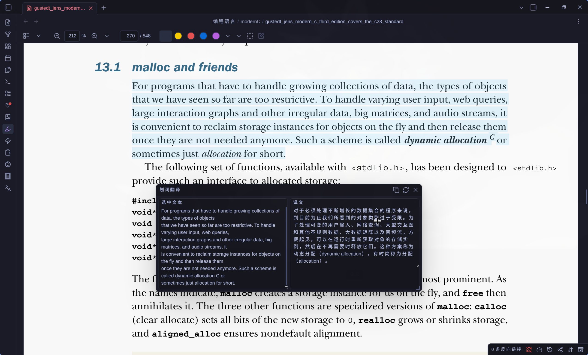
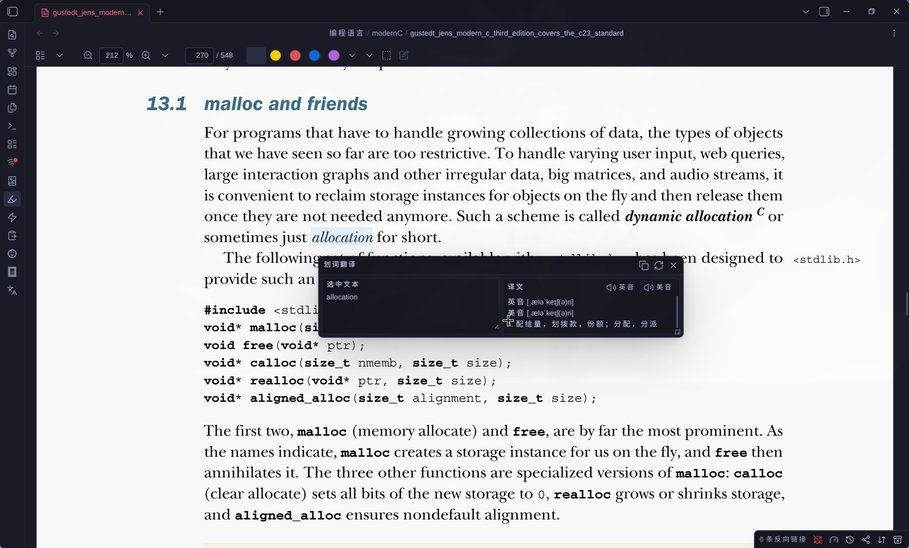
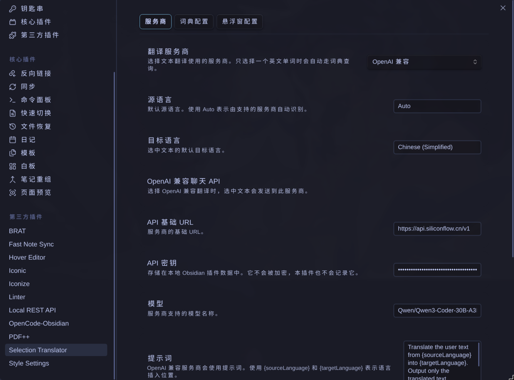
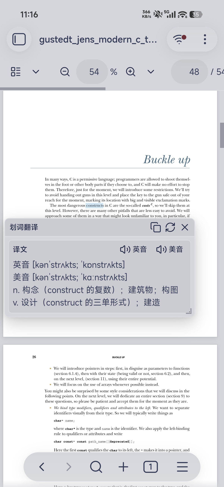
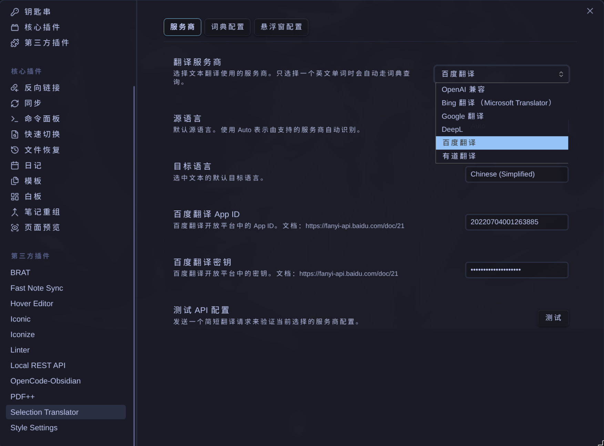
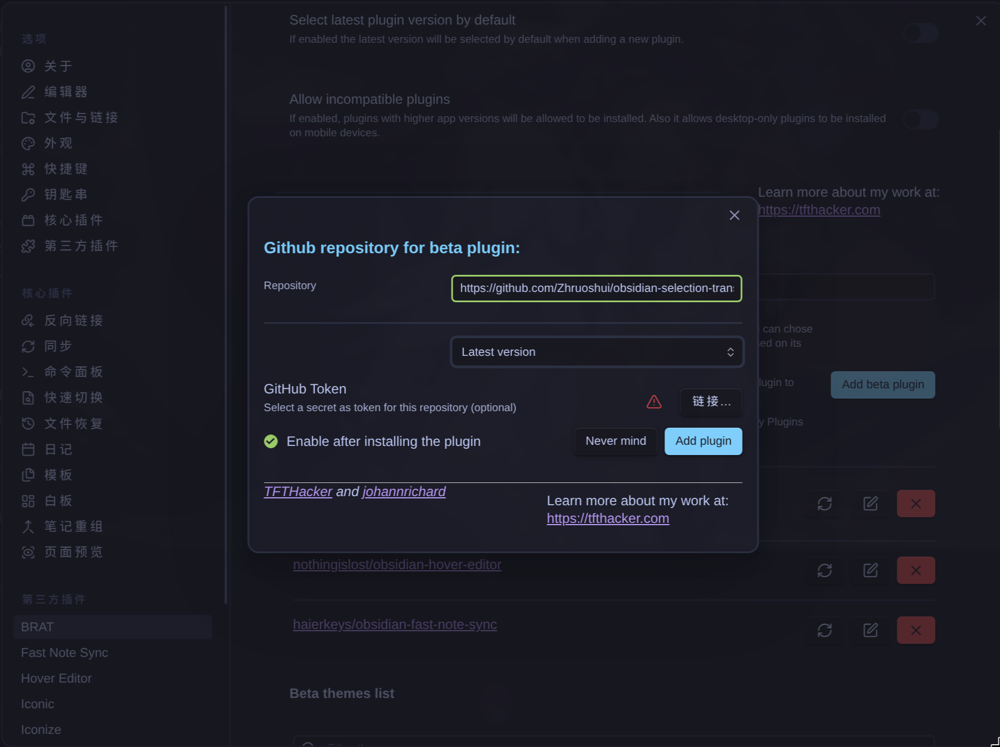

# Selection Translator

[中文说明](README.zh-CN.md)

[Features](#features) |
[Quick Start](#quick-start) |
[Settings](#settings) |
[Usage Guide](#usage-guide) |
[Privacy](#privacy) |
[Install](#install) |
[FAQ](#faq) |
[Development](#development)

Selection Translator is an Obsidian plugin for translating selected Markdown editor and PDF text with selectable AI and traditional translation providers plus automatic dictionary lookup.



---

## Features

### Selection Translation

- Translate selected Markdown editor or selectable PDF text from the command palette, a hotkey, the ribbon button, or the Markdown editor context menu.
- Keep the floating popover open while selecting more text; the new Markdown or PDF selection is translated automatically.
- Edit the selected source text in the popover and translate again.
- Automatically look up one selected English word with the configured dictionary provider and play UK/US pronunciations when available.



### Language Defaults

- Set default source and target languages in plugin settings.
- Use `Auto` as the source language when you want a supported provider to detect the input language.



### Popover Workflow

- Stream translation progress, errors, and results in a draggable and resizable popover.
- Use compact header buttons to copy the full result, retry translation, or close the popover.
- Select any part of the translation result and copy it with native keyboard or context-menu copy.
- Header layout is compact for desktop and narrow mobile screens.

<p align="center">
  
</p>

### Provider Support

- Choose the text translation provider yourself. OpenAI-compatible providers, Bing Translate (Microsoft Translator), Google Cloud Translation, DeepL, Baidu Translate, and Youdao Translate are selectable options.
- Configure the credentials required by the selected provider.
- OpenAI-compatible providers support prompt, temperature, and streaming output. Traditional translation APIs return the translated result when the provider request completes.
- One selected English word automatically uses the configured dictionary provider. Youdao Dictionary, Bing Dictionary, and Cambridge Dictionary are selectable and do not require an API key.
- Test the provider configuration before translating.
- Plugin UI follows Obsidian's app language for English and Simplified Chinese.



---

## Quick Start

1. Install the plugin with BRAT or manual installation.
2. Open **Settings -> Community plugins -> Selection Translator**.
3. Choose a **Translation provider**.
4. Choose a **Dictionary provider** if you want a provider other than Youdao Dictionary.
5. Configure the credentials required by the translation provider.
6. Set default **Source language** and **Target language**.
7. Select **Test** to verify the translation provider configuration.
8. Select text in a Markdown editor or selectable PDF text in Obsidian's PDF view.
9. Run **Translate selection** from the command palette, a hotkey, the ribbon button, or the editor context menu.

The default prompt translates from `Auto` into `Chinese (Simplified)` and returns only the translated text.

---

## Settings

The settings page is grouped into **Provider**, **Dictionary config**, **Popover config**, and **Advanced** tabs.

### Provider

| Setting | Default | Description |
| --- | --- | --- |
| Translation provider | `OpenAI-compatible` | Selects which provider handles non-dictionary translation requests. |
| Source language | `Auto` | Default source language. Use `Auto` for provider-side detection when supported. |
| Target language | `Chinese (Simplified)` | Default target language. |
| OpenAI-compatible API base URL | `https://api.openai.com/v1` | Provider base URL. The plugin appends `/chat/completions` when needed. |
| OpenAI-compatible API key | empty | Bearer token for the configured OpenAI-compatible provider. |
| OpenAI-compatible model | empty | Model name supported by your provider. |
| OpenAI-compatible prompt | built in | Translation instruction for OpenAI-compatible providers. Use `{sourceLanguage}` and `{targetLanguage}` for the configured languages. |
| OpenAI-compatible temperature | `0.2` | Lower values keep OpenAI-compatible translations more deterministic. |
| Maximum selection length | `4000` | Blocks accidental large sends. This setting is shown with OpenAI-compatible options but applies before every provider request. |
| Bing/Microsoft Translator key | empty | Subscription key for the Microsoft Translator resource used by Bing Translate. |
| Bing/Microsoft Translator region | empty | Resource region, such as `eastasia` or `global`. |
| Bing/Microsoft Translator endpoint | `https://api.cognitive.microsofttranslator.com` | Translator endpoint. |
| Google Cloud Translation API key | empty | API key for Google Cloud Translation Basic v2. |
| DeepL Auth Key | empty | Authentication key from your DeepL account. |
| DeepL API base URL | `https://api-free.deepl.com` | Use `https://api.deepl.com` for DeepL Pro. |
| Baidu Translate app ID | empty | App ID from Baidu Translate Open Platform. |
| Baidu Translate secret key | empty | Secret key from Baidu Translate Open Platform. |
| Youdao Translate app key | empty | App key from Youdao Zhiyun translation service. |
| Youdao Translate app secret | empty | App secret from Youdao Zhiyun translation service. |
| Test API configuration | - | Sends a short translation request to verify the selected provider configuration. |

The public Google Translate and Bing Translator websites can be free for manual
use, but this plugin uses official provider APIs for those translation
providers. API access requires provider credentials even when the provider
offers a free quota or free tier. Dictionary lookup is automatic for one
selected English word and uses the configured dictionary website without API
credentials.

| Provider | API access note | Key setup | Pricing |
| --- | --- | --- | --- |
| Bing Translate (Microsoft Translator) | Azure Translator API has an F0 free tier, but it still requires an Azure Translator resource key, endpoint, and sometimes region. | [Create a Translator resource](https://learn.microsoft.com/en-us/azure/ai-services/translator/create-translator-resource) | [Azure Translator pricing](https://azure.microsoft.com/pricing/details/cognitive-services/translator/) |
| Google Cloud Translation | Cloud Translation has monthly free usage credits, but API calls require a Google Cloud project, billing, enabled API, and credentials. | [Cloud Translation setup](https://cloud.google.com/translate/docs/setup), [Create API keys](https://cloud.google.com/docs/authentication/api-keys#create) | [Cloud Translation pricing](https://cloud.google.com/translate/pricing) |
| DeepL | Requires a DeepL API account and Auth Key. Use `https://api-free.deepl.com` for API Free and `https://api.deepl.com` for API Pro. | [DeepL API authentication](https://developers.deepl.com/docs/getting-started/auth) | [DeepL API plans](https://www.deepl.com/pro-api) |
| Baidu Translate | Requires a Baidu Translate Open Platform App ID and secret key. | [Baidu Translate API docs](https://fanyi-api.baidu.com/doc/21), [Open Platform](https://fanyi-api.baidu.com/) | [Baidu Translate products](https://fanyi-api.baidu.com/product/11) |
| Youdao Translate | Requires a Youdao Zhiyun app key and app secret. | [Youdao new user guide](https://ai.youdao.com/doc.s#guide), [App management](https://ai.youdao.com/appmgr.s), [Text translation API docs](https://ai.youdao.com/DOCSIRMA/html/trans/api/wbfy/index.html) | [Youdao text translation pricing](https://ai.youdao.com/DOCSIRMA/html/trans/price/wbfy/index.html) |
| Dictionary lookup | No API key is required. It sends one selected English word to the configured dictionary website and uses pronunciation audio URLs from that provider when available. | [Youdao Dictionary](https://m.youdao.com/dict), [Bing Dictionary](https://cn.bing.com/dict), [Cambridge Dictionary](https://dictionary.cambridge.org/) | - |

### Dictionary Config

| Setting | Default | Description |
| --- | --- | --- |
| Dictionary provider | `Youdao Dictionary` | Selects which dictionary website handles one-word dictionary lookup. Options: Youdao Dictionary, Bing Dictionary, Cambridge Dictionary. |

### Popover Config

| Setting | Default | Description |
| --- | --- | --- |
| Show selected text in popover | enabled | Shows selected text as an editable field before retrying. |

### Advanced

| Setting | Default | Description |
| --- | --- | --- |
| Enable cache | enabled | When enabled, repeated translations of the same text within the cache TTL skip the network. |
| Cache TTL (seconds) | `600` | Time-to-live for a cache entry. `0` means no expiration. Otherwise 60-86400. |
| Cache max entries | `256` | Maximum cached translations. Oldest entry is dropped first (LRU). |
| Min interval (ms) | `1500` | Per-provider minimum delay between consecutive translation requests. `0` disables throttling. |
| Enable retry | enabled | Retries 429/5xx and known rate-limit errors using the backoff below. |
| Max attempts | `2` | Total attempts including the first one. `0` means no retries at all. |
| Base delay (ms) | `500` | Initial backoff delay. Subsequent delays double up to the max below. |
| Max delay (ms) | `3000` | Upper bound on the backoff delay. `baseDelayMs * 2^attempt + jitter` is clamped to this value. |
| Jitter ratio | `0.2` | Random jitter as a fraction of the exponential delay (0-0.5). |

Provider error responses now carry the HTTP status code as
`error.cause.status`. The retry loop checks this first (429 or 5xx ⇒ retry);
if absent, it falls back to the keyword whitelist (`invalid access limit`,
`rate limit`, etc.) and a numeric-code regex.

---

## Usage Guide

### Basic Translation

1. Select text in Markdown or a selectable PDF text layer.
2. Run **Translate selection**.
3. Read the streaming result in the popover.
4. Select part of the result if you only need to copy a specific phrase or paragraph.

### Dictionary Lookup

1. Select one English word in Markdown or a selectable PDF text layer.
2. Run **Translate selection**.
3. Use the pronunciation buttons in the result header to play UK or US audio.

### Language Direction

1. Open the plugin settings.
2. Change **Source language** and **Target language** in the **Provider** tab.
3. Run **Translate selection** again. Later translations use the saved language values.

### Waiting For The Next Selection

Select the ribbon button before selecting text. The popover opens in a waiting state, then translates the next Markdown editor or PDF selection.

PDF support requires a selectable PDF text layer. Scanned pages without OCR text cannot be translated by selection.

---

## Privacy

This plugin does not collect telemetry and does not scan your vault.

When you translate selected Markdown or PDF text, only the selected text is sent to the translation provider currently selected in plugin settings. When the selection is one English word, that word is sent to the configured dictionary provider instead and pronunciation audio is loaded from that provider when available. Do not translate sensitive content unless you trust that provider.

Provider credentials are stored locally in Obsidian plugin data through `saveData()`. Secret fields are rendered as password fields in settings, but Obsidian plugin data is local plaintext storage, not encrypted storage. The plugin does not log provider credentials.

---

## Install

### Install With BRAT

This plugin is distributed as a beta plugin through GitHub releases. Install it with the Obsidian BRAT plugin:

1. Install and enable **BRAT** from Obsidian's community plugins.
2. Open **Settings -> BRAT -> Beta Plugin List**.
3. Select **Add Beta plugin**.
4. Enter this repository URL:

```text
https://github.com/Zhruoshui/obsidian-selection-translator
```



5. Enable **Selection Translator** in **Settings -> Community plugins**.

BRAT installs the release assets from GitHub. Each release must include `main.js`, `manifest.json`, and `styles.css`.

### Manual Installation

Download `main.js`, `manifest.json`, and `styles.css` from the latest GitHub release, then copy them to:

```text
<Vault>/.obsidian/plugins/selection-translator/
```

Reload Obsidian and enable the plugin in **Settings -> Community plugins**.

---

## FAQ

### Configuration test failed

- Confirm the API base URL is correct and reachable.
- Confirm the credentials are valid for the selected provider.
- For OpenAI-compatible providers, confirm the model name exists on that provider.

### Translation popup does not appear

- Confirm text is selected in the active Markdown editor or a selectable PDF text layer.
- Try the command palette command **Translate selection**.
- For PDF files, confirm the PDF has selectable text and is not only a scanned image.

### Source language does not affect output

- Use the default prompt or include `{sourceLanguage}` in your custom prompt.
- The plugin also adds missing language direction context before custom prompts that omit a language placeholder.

---

## Development

### Symlink for Development

During development, symlink the repository into the vault's plugins directory so you can run `npm run build` and reload Obsidian without copying files manually.

**Linux / macOS**:

```bash
ln -s /path/to/obsidian-selection-translator "<Vault>/.obsidian/plugins/selection-translator"
```

**Windows** (requires administrator or Developer Mode):

```cmd
mklink /D "<Vault>\.obsidian\plugins\selection-translator" "C:\path\to\obsidian-selection-translator"
```

You can also create a directory junction on Windows (no admin required):

```cmd
mklink /J "<Vault>\.obsidian\plugins\selection-translator" "C:\path\to\obsidian-selection-translator"
```

After linking, `npm run build` compiles `main.js` into the plugin folder directly. Reload Obsidian or disable and re-enable the plugin to pick up changes.

---

Install dependencies:

```bash
npm install
```

Run a production build:

```bash
npm run build
```

Run lint:

```bash
npm run lint
```

---

## License

This project is licensed under the MIT License. You are free to use, modify, and distribute it, provided you retain the original copyright notice and license statement.

---

## Acknowledgments

Thanks to the LinuxDo community (https://linux.do) for their support.
